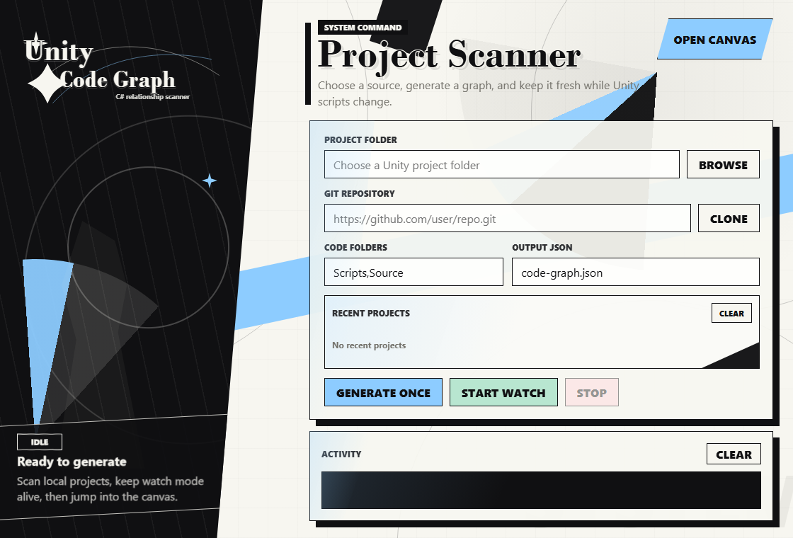
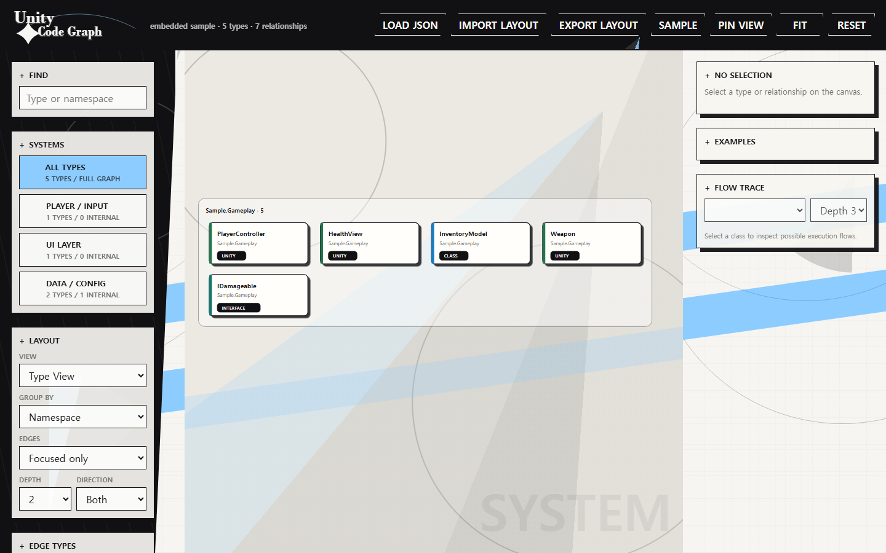
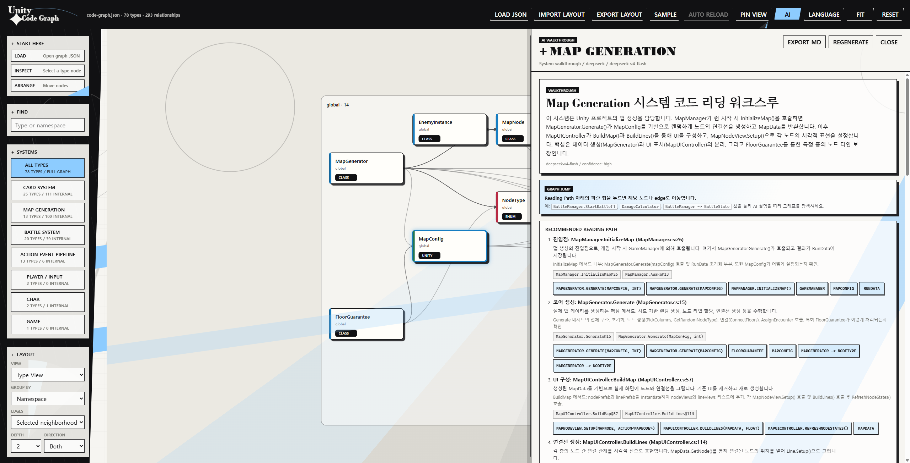
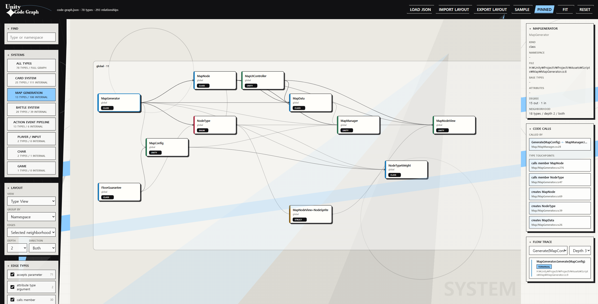

<p align="center">
  
</p>

<h1 align="center">Unity Code Graph</h1>

<p align="center">
  <strong>Unity/C#을 위한 타입 관계, 호출 흐름, AI 워크스루 로컬 분석 도구</strong>
  <br />
  <em>AI 키가 없어도 동작하고, 필요할 때만 코드 읽기 가이드를 생성합니다.</em>
</p>

<p align="center">
  <a href="README.md"><strong>한국어</strong></a>
  ·
  <a href="README.en.md">English</a>
    ·
  <a href="https://github.com/SkylightStudio07/UnityCodeGraph/releases">Latest Release</a>
</p>

<p align="center">
  
  
  
  
  
  
</p>

<p align="center">
  <a href="#빠른-시작">빠른 시작</a>
  ·
  <a href="#런처">런처</a>
  ·
  <a href="#웹-뷰어">웹 뷰어</a>
  ·
  <a href="#ai-워크스루">AI 워크스루</a>
  ·
  <a href="#빌드와-퍼블리시">빌드</a>
  ·
  <a href="#분석-검증">검증</a>
</p>

---

## 미리보기







## 이것은 무엇인가요?

Unity Code Graph는 Unity 프로젝트나 일반 C# 폴더를 스캔해서 `.cs` 파일 안의
타입 관계와 메서드 호출 관계를 JSON 그래프로 만듭니다. 생성된 그래프는 포함된
웹 뷰어에서 열 수 있고, 노드 위치를 직접 정리하거나 시스템 단위로 접어볼 수
있습니다.

기본 분석 패스는 AI를 사용하지 않습니다. C# 문법에서 기계적으로 확인 가능한
관계를 추출하기 때문에 결과가 로컬에서 반복 가능하고 설명 가능한 형태로
유지됩니다. AI 기능은 선택 사항이며, 설정한 provider API를 통해 노드나 시스템을
읽는 순서를 설명하는 보조 기능으로만 동작합니다.

## 주요 기능

| 영역 | 기능 |
| --- | --- |
| 코드 스캔 | 로컬 Unity 프로젝트, 일반 C# 폴더, 공개 Git 저장소 |
| 타입 그래프 | 클래스, 구조체, 레코드, 인터페이스, enum 노드 |
| 관계 추출 | 상속, 구현, 필드, 프로퍼티, 파라미터, 지역 변수, 객체 생성, 캐스트, 타입 체크, 어트리뷰트 |
| Unity 패턴 | `GetComponent<T>()`, `AddComponent<T>()`, `FindObjectOfType<T>()`, `CreateInstance<T>()` |
| 호출 그래프 | 문법상 해석 가능한 메서드 호출과 타입 간 호출 요약 |
| 웹 뷰어 | 시스템 클러스터, 시스템 리포트, 플로우 트레이스, Code Calls, 자동 리로드, 첫 실행 안내, AI 컨텍스트 MD/JSON export |
| AI 보조 | 노드 요약, 시스템 요약, 코드 읽기 워크스루, 근거 edge 표시, 워크스루 칩으로 그래프 점프 |
| 레이아웃 | 노드 위치 저장, `Export Layout`, `Import Layout` |
| 런처 | WebView2 GUI, 최근 프로젝트, watch 모드, 내장 로컬 서버, AI provider 프록시 |

## 요구 사항

- Windows
- .NET 9 SDK
- WebView2 Runtime
- Node.js: 단축 빌드의 JavaScript 문법 체크와 선택적 정적 서버 실행에 사용

## 빠른 시작
- 최신 릴리즈는 이 쪽으로.  
https://github.com/SkylightStudio07/UnityCodeGraph/releases
---

전체 빌드와 JavaScript 문법 체크:

```powershell
.\build.bat
```

Unity 프로젝트에서 그래프 생성:

```powershell
dotnet run --project .\UnityCodeGraph -- <Unity 프로젝트 경로> --roots Scripts,Source --output graph.json
```

코드 폴더를 직접 지정해서 생성:

```powershell
dotnet run --project .\UnityCodeGraph -- <Unity 프로젝트 경로>\Assets\Scripts --output graph.json
```

`.cs` 파일 변경 시 자동 재생성:

```powershell
dotnet run --project .\UnityCodeGraph -- <Unity 프로젝트 경로> --roots Scripts,Source --watch --output graph.json
```

## 런처


소스에서 런처 실행:

```powershell
dotnet run --project .\UnityCodeGraph.Launcher
```

혹은 이미 빌드되어 있는 런처를 사용하려면:

```powershell
UnityCodeGraphLauncher.exe
```

런처에서 할 수 있는 일:

- Unity 프로젝트 폴더 선택
- 공개 Git 저장소 clone
- `Scripts,Source` 같은 코드 폴더 이름 지정
- 한 번 생성 또는 watch 모드 시작
- 최근 프로젝트 다시 열기
- 그래프 캔버스를 브라우저에서 열기

`Open Canvas`는 런처 내장 로컬 정적 서버를 시작합니다. 설정된 `Output JSON`
파일이 존재하면 캔버스가 자동으로 해당 그래프를 불러옵니다.

## 웹 뷰어


가장 쉬운 방법은 런처의 `Open Canvas` 버튼으로 접근하는 방법입니다.

직접 열고 싶다면 workspace 루트를 정적 서버로 띄웁니다:

```powershell
dotnet run --project .\UnityCodeGraph -- .\samples\MiniUnityStyle --output .\samples\mini-graph.json
node .\tools\static-server.mjs 5173 .
```

그 다음 브라우저에서 엽니다:

```text
http://localhost:5173/web/
```

### 웹 뷰어 사용법:



- `Load JSON`으로 이전에 런처에서 생성한 그래프 파일 열기
- `Type View`로 타입 단위 관계 확인
- `System View`로 시스템 카드 단위 확인
- `Pin View`로 선택된 관계 뷰를 유지한 채 노드 위치 재배치
- `Auto Reload`로 런처 watch 모드가 갱신한 그래프 JSON 자동 반영
- `Export Layout` / `Import Layout`로 노드 위치, 필터, 뷰 모드, 줌 상태 이동
- `Short / Standard / Detailed Context`로 분량을 고른 뒤 `Export AI Context`로 시스템별 읽기 순서와 근거가 담긴 Markdown/JSON 컨텍스트 생성
- 노드를 선택해 상세 정보, 예시, 코드 호출 요약, 플로우 트레이스 확인

## AI 워크스루


AI 기능은 선택 사항입니다. API 키가 없거나 요청이 실패해도 그래프 생성, 웹 뷰어,
레이아웃 저장, 자동 리로드 같은 기본 기능은 그대로 사용할 수 있습니다.

사용 방법:

1. 런처에서 `Open Canvas`로 웹 뷰어를 엽니다.
2. 우측 상단 `AI`를 눌러 provider, base URL, model, API key를 설정합니다.
3. `Remember API key on this Windows user profile`을 켜고 `Save AI`를 누르면 API key가 현재 Windows 사용자 프로필에 저장됩니다.
4. 노드나 좌측 `SYSTEMS`의 시스템을 선택한 뒤 `AI Walkthrough`를 실행합니다.
5. 워크스루 패널의 `Reading Path` 아래 파란 칩을 누르면 해당 노드나 edge로 그래프가 이동하고 하이라이트됩니다.

지원 provider:

- OpenAI Responses API
- OpenRouter / OpenAI-compatible Chat Completions
- DeepSeek Chat Completions
- Ollama local chat API
- Vertex AI: Project ID, location, service account JSON 또는 `GOOGLE_APPLICATION_CREDENTIALS` 사용

Vertex에서 `Location`을 `global`로 쓰는 경우 base URL은 `https://aiplatform.googleapis.com`을 사용합니다.
지역 location 예: `us-central1`은 기본 설정에서 `https://us-central1-aiplatform.googleapis.com`으로 호출됩니다.

API key는 브라우저 localStorage, graph JSON, layout JSON에 저장하지 않습니다.
저장을 선택하면 런처가 `AppData\Local\UnityCodeGraph\ai-settings.json`에 현재 Windows
사용자 기준 DPAPI로 암호화한 값을 보관합니다. Vertex 서비스 계정 JSON도 같은 저장
옵션을 사용할 때만 암호화해 보관합니다.

## 빌드와 퍼블리시

빠른 Debug 빌드:

```powershell
.\build.bat
```

기존 `dist\UnityCodeGraph-win-x64\`가 있으면 최신 웹뷰어 파일도 함께 동기화됩니다.
실행 파일을 새로 퍼블리시하려면 `-Publish`를 사용하세요.

Release 빌드 체크:

```powershell
.\build.bat -Release
```

Windows 번들과 zip 생성:

```powershell
.\build.bat -Release -Publish -Zip
```

퍼블리시 중인 런처 실행 파일이 이미 열려 있으면 덮어쓸 수 없습니다. 이 경우
`UnityCodeGraphLauncher.exe`를 닫고 다시 실행하세요.

생성 위치:

```text
dist\UnityCodeGraph-win-x64\
dist\UnityCodeGraph-win-x64.zip
```

퍼블리시된 런처 실행:

```powershell
.\dist\UnityCodeGraph-win-x64\UnityCodeGraphLauncher.exe
```

퍼블리시된 CLI 실행:

```powershell
.\dist\UnityCodeGraph-win-x64\UnityCodeGraph.exe <Unity 프로젝트 경로> --roots Scripts,Source --output graph.json
```

대상 PC에 맞는 .NET 런타임이 없어도 실행 가능한 더 큰 패키지 생성:

```powershell
.\build.bat -Release -Publish -Zip -SelfContained
```


## 분석 검증

파서 회귀 검증 fixture 실행:

```powershell
powershell -NoProfile -ExecutionPolicy Bypass -File .\tools\verify-analysis.ps1
```

이 fixture는 using 기반 타입 해석, 타입 제약, Unity 제네릭 호출, 캐스트와
타입 체크, 정적 호출, 메서드 호출 간선, 중복 타입명 오탐 방지를 확인합니다.

## 추출 관계

```text
inherits                         implements
has_attribute                    member_attribute
attribute_type_argument          type_constraint
has_field_type                   has_property_type
has_event_type                   returns
accepts_parameter                uses_local_type
creates                          typeof
casts_to                         type_check
calls_member                     unity_get_component
unity_try_get_component          unity_add_component
unity_find_object                unity_create_scriptable_object
```


## 상태

이 프로젝트는 현재 preview 단계입니다. 분석은 정적 문법 기반이라 빠르고
반복 가능하지만, 컴파일러 semantic model을 사용하는 완전한 타입 해석기는 아직
아닙니다.
